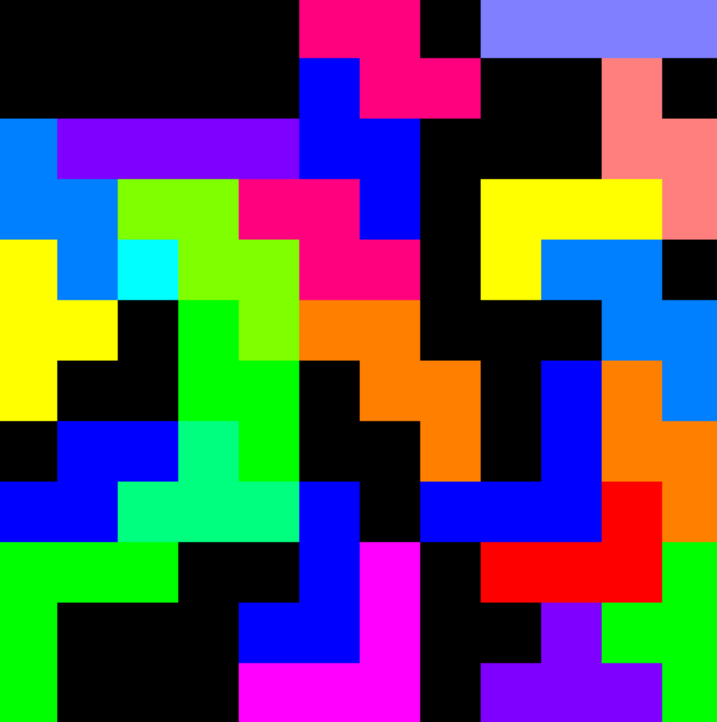
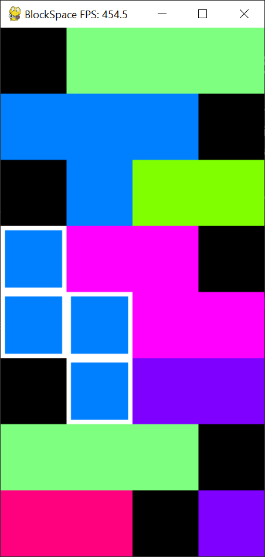
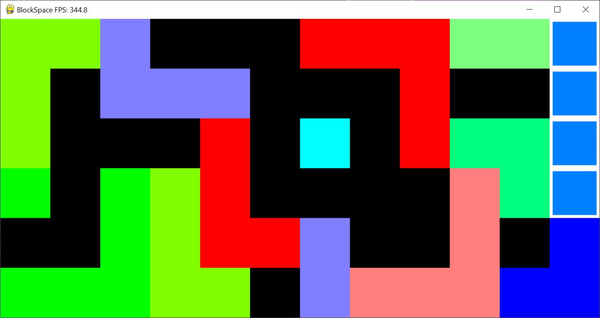

# BlockSpace

- a game about clearing lines and rows infinitely
- fill a line or a row to clear it
- you can modify the grid dimensions, blocks in `main.py`

## Key Features
- You can't loose
- You can't win
- Infinite games

## Gameplay

## Controls

### With the Mouse:
- **click** to 'roll' a random block
- **click** to place the block

### With the Keyboard:

- **ZQSD/WASD** to move the block **up, left, down, right**
- **SPACE/RETURN** to 'roll' a random block
- **SPACE/RETURN** to place the block
- **ESCAPE/ECHAP** to close the game

## Dependencies used
- python 3.13.0
- pygame 2.5.0

## How to Install
- Have a suitable python version installed.
- The same goes for pygame (write `pip install pygame` in a terminal)
### How to Launch
`Code` -> `Download ZIP` -> Extract all ->
Go in the main folder -> Execute/Double click `main.py`

## License
No license
